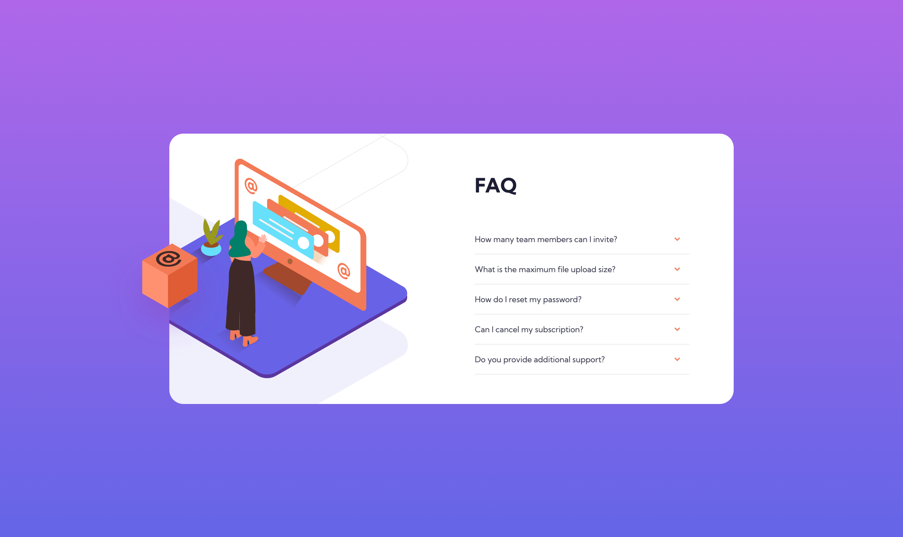

# Frontend Mentor - FAQ accordion card solution

This is a solution to the [FAQ accordion card challenge on Frontend Mentor](https://www.frontendmentor.io/challenges/faq-accordion-card-XlyjD0Oam).

## Table of contents

- [Overview](#overview)
  - [The challenge](#the-challenge)
  - [Screenshot](#screenshot)
  - [Links](#links)
- [My process](#my-process)
  - [Built with](#built-with)
  - [What I learned](#what-i-learned)
  - [Useful resources](#useful-resources)
- [Author](#author)

## Overview

### The challenge

Users should be able to:

- View the optimal layout for the component depending on their device's screen size
- See hover states for all interactive elements on the page
- Hide/Show the answer to a question when the question is clicked

### Screenshot



### Links

- Solution URL: [https://github.com/Blondeli/faq-accordion-card](https://github.com/Blondeli/faq-accordion-card)
- Live Site URL: [https://blondeli.github.io/faq-accordion-card/](https://blondeli.github.io/faq-accordion-card/)

## My process

### Built with

- Semantic HTML5 markup
- CSS custom properties
- Flexbox
- Mobile-first workflow

### What I learned

- Making an accordion using only CSS

It uses the following HTML structure:

```html
<input type="checkbox" id="title1" />
<label for="title1">Accordion One</label>

<div class="content">
  <p>Your content goes here.</p>
</div>
```

It's important to make sure that you enter the same value for "id" (input element) and "for" (label element)!

</br>

Now we have to style the elements accordingly. First, we have to hide the "input" tag because we won't need it to show.

```css
input {
  display: none;
}
```

Now, you can style the label and the div tag according to your design. Finally, you have to add the pseudo class to show and hide the content.

```css
input + label + .content {
  display: none;
}

input:checked + label + .content {
  display: block;
}
```

</br>

- Adding arrows to the accordion

I added arrows next to each accordion label. I wanted the arrow to point down if the accordion is closed and to point up if the accordion is open. I used the pseudo class "::after" to achieve this.

```css
label {
  position: relative;
}

label::after {
  content: url(images/icon-arrow-down.svg);
  position: absolute;
  right: 15px;
  top: 15px;
}

input:checked + label::after {
  transform: rotate(180deg);
}
```

I inserted the arrow svg using the pseudo "::after" and rotated it 180 degrees when the accordion is open.

</br>

- Adding an animation to the accordion

I decided to add an animation to the accordion to have a smooth transition when opening it. I found out that I can't use the display property to hide and show my content because the animation won't work with display. Therefore, I adjusted my CSS accordingly.

```css
input + label + .content {
  height: 0;
  opacity: 0;
  overflow: hidden;
  transition: all 200ms ease-in-out;
}

input:checked + label + .content {
  opacity: 1;
  height: auto;
}
```

### Useful resources

- [Make a pure CSS accordion without JavaScript](https://supfort.com/pure-css-accordion-without-javascript) - This helped me to create the accordion using only CSS.
- [Adding toggle plus and minus signs to a pure CSS accordion](https://supfort.com/add-toggle-plus-minus-css-accordion) - This helped me to add the arrows to my accordion.
- [WS3 Schools - Collapsibles / Accordion](https://www.w3schools.com/howto/howto_js_accordion.asp) - This page helped me to understand how I can create a smooth animation on my accordion.

## Author

- Frontend Mentor - [@Blondeli](https://www.frontendmentor.io/profile/blondeli)
- LinkedIn - [Elisabeth Martin](https://www.linkedin.com/in/elisabeth-martin-873773199/)
